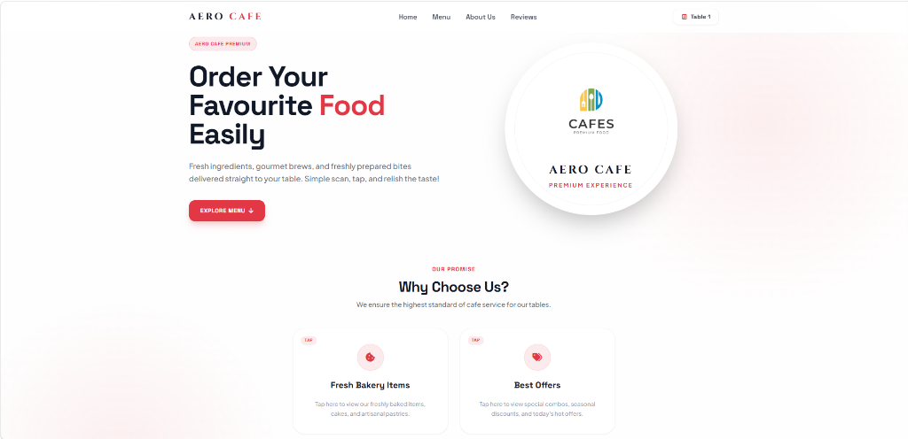
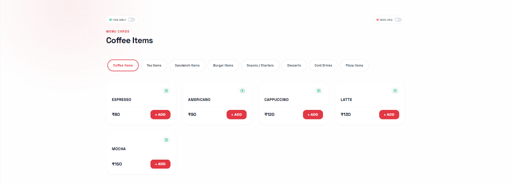
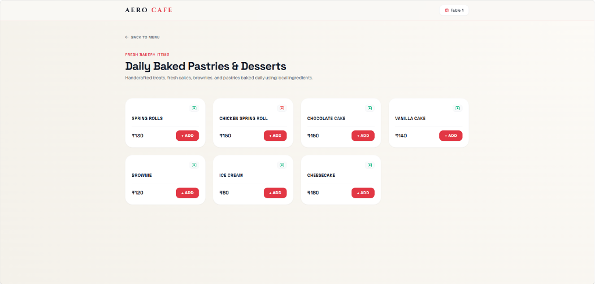
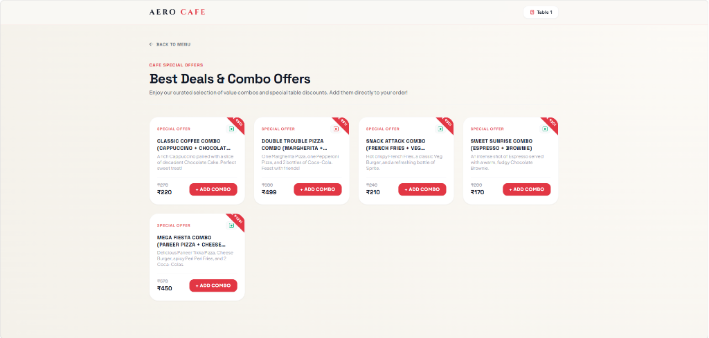
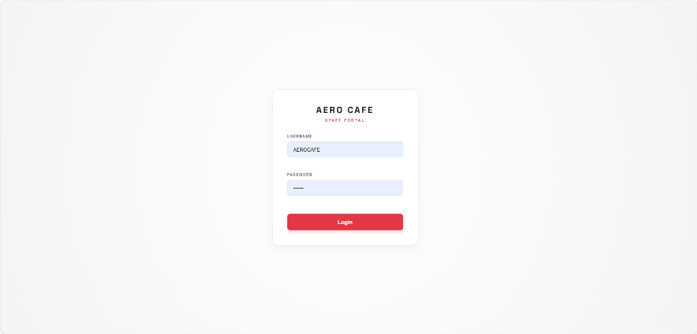

# Aero Cafe — Hotel Management & Table Ordering System

A production-ready, highly secure, and containerized **Hotel Management & Digital Table Ordering System** built using Python, FastAPI, and SQLAlchemy (MySQL/SQLite). 

This system features QR-code table verification signatures, live kitchen dashboards via WebSockets, automatic billing/invoicing, JWT authentication, and Role-Based Access Control (RBAC).

---

## Screenshots

### 1. Minimalist Guest Landing Page


### 2. Contactless Digital Guest Menu


### 3. Fresh Bakery & Desserts Subpage


### 4. Combo Deals & Offers Subpage


### 5. Staff Secure Login Portal


---

## Project Structure

```
QR_SCAN_MENU ORDARING SYSTEM/
├── backend/
│   ├── config.py            # Pydantic Settings env loader
│   ├── database.py          # SQLAlchemy Connection Pool & SQLite Fallback
│   ├── security.py          # JWT, Passlib hashing, and HMAC QR signatures
│   ├── models/              # SQLAlchemy Database Tables
│   │   ├── menu.py
│   │   ├── orders.py
│   │   ├── invoice.py
│   │   └── user.py
│   ├── schemas/             # Pydantic Input/Output Schemas
│   │   ├── menu.py
│   │   ├── orders.py
│   │   ├── invoice.py
│   │   └── user.py
│   ├── services/            # Transactional Business Logic
│   │   ├── order_service.py
│   │   └── invoice_service.py
│   ├── routers/             # FastAPI Route Endpoints
│   │   ├── menu.py
│   │   ├── orders.py
│   │   ├── invoice.py
│   │   └── auth.py
│   └── main.py              # Application Entry & Initial Seeding
│
├── frontend/                # Reorganized HTML/CSS/JS Client Assets
│   ├── index.html           # Table check entry point
│   ├── qrcodes.html         # Table QR Code printable generator
│   ├── config.js            # Frontend dynamically resolved base URLs
│   ├── MenuPage/            # Guest menu ordering page
│   ├── kitchen/             # Kitchen live orders dashboard
│   ├── Invoice/             # Bill print and confirmation screen
│   └── assets/              # Shared static resources (CSS, images)
│
├── sql/
│   └── hotel_db.sql         # MySQL database creation script
│
├── tests/
│   └── test_endpoints.py    # Automated API integration test suite
│
├── .env                     # Local environment settings
├── .gitignore
├── requirements.txt         # Pinned backend dependencies
├── Dockerfile               # Production FastAPI container spec
├── docker-compose.yml       # Integrated database & server composition
└── README.md
```

---

## Features

- **Anti-Tampering Table Ordering**: Each QR code embeds a unique, HMAC-SHA256 signature for its table ID. The backend verifies the signature on every order submission to prevent guests from tampering with table parameters.
- **Live Kitchen Dispatch**: A real-time dashboard powered by WebSockets notifies the kitchen when new orders are placed or edited.
- **JWT & Role-Based Access Control**:
  - **Admin**: Full menu management (CRUD categories/items) and financials access.
  - **Waiter**: Order placements, status updates, and invoice generation.
  - **Kitchen**: Active order view and cooking status transitions.
- **Automated Invoicing**: Real-time invoice aggregation, pricing summary, payment completion tracking, and print layouts.
- **Database Resiliency**: Built-in pooling with automatic fallback to local SQLite files if the MySQL database fails to connect.

---

## Setup & Running Locally

### 1. Requirements
Ensure you have Python 3.10+ installed.

### 2. Environment Configuration
Create a `.env` file at the root directory of `HotelManagement/` (a template is provided by default):
```env
DATABASE_URL=sqlite:///./hotel_management.db
JWT_SECRET=super-secret-jwt-key-2026-change-me-in-production
JWT_ALGORITHM=HS256
ACCESS_TOKEN_EXPIRE_MINUTES=60
QR_SECRET=aero-cafe-secret-2026-change-this-to-something-random
```

### 3. Local Installation
```bash
# Navigate to project root
cd HotelManagement

# Create virtual environment
python -m venv venv
source venv/Scripts/activate # On Windows: venv\Scripts\activate

# Install dependencies
pip install -r requirements.txt

# Start the development server
uvicorn backend.main:app --reload
```

The application will start, seed the SQLite database with default users and menu items, and serve:
- **API Swagger Docs**: `http://localhost:8000/docs`
- **Customer QR Landing**: `http://localhost:8000/`
- **QR Code Printer**: `http://localhost:8000/qrcodes.html`
- **Kitchen Dashboard**: `http://localhost:8000/kitchen/kitchen.html`

---

## Running with Docker (Recommended)

To run the complete production stack (FastAPI server + MySQL database) inside containers:

```bash
# Build and run the docker-compose stack
docker-compose up --build
```
This command starts:
1. **db**: MySQL container initialized with `sql/hotel_db.sql` on port `3306`.
2. **web**: FastAPI server running on port `8000` connected to the MySQL container.

---

## Authentication & Preseeded Roles

When the backend starts, it automatically seeds three default users:

| Username | Password | Role |
| :--- | :--- | :--- |
| **admin** | `admin123` | admin |
| **waiter** | `waiter123` | waiter |
| **kitchen** | `kitchen123` | kitchen |

Use `/api/auth/login` to obtain a JWT bearer token for role-protected API endpoints.

---

## Running Automated Tests

Run the backend unit tests to verify authentication, menu access, and table signatures:

```bash
python -m unittest tests/test_endpoints.py
```

---

## Deployment Guidelines

### 1. Railway Deployment
1. Create a new project on Railway and link your Github repository.
2. Under Railway, provision a **MySQL Database** service.
3. Add a **New Service** from your linked Github repo.
4. Set the following Environment Variables under the service Settings:
   - `DATABASE_URL`: Set to Railway's MySQL connection string (e.g., `mysql+pymysql://...`).
   - `JWT_SECRET`: A secure random password string.
   - `QR_SECRET`: A secure random password string.
5. Railway will automatically detect the `Dockerfile` and start the uvicorn app.

### 2. Render Deployment
1. Set up a **Web Service** on Render pointing to your Github repo.
2. Select runtime as **Docker**.
3. Under Environment variables, configure your `DATABASE_URL` (connecting to a Render Managed PostgreSQL/MySQL or external database), `JWT_SECRET`, and `QR_SECRET`.
4. Render will build and deploy the container automatically.

### 3. VPS Deployment (Nginx + Systemd)
1. Clone the repository onto your VPS server.
2. Configure **Systemd** to run the FastAPI app:
   ```ini
   [Unit]
   Description=FastAPI Hotel Management System
   After=network.target

   [Service]
   User=www-data
   WorkingDirectory=/opt/HotelManagement
   Environment="PYTHONPATH=/opt/HotelManagement"
   ExecStart=/opt/HotelManagement/venv/bin/uvicorn backend.main:app --host 127.0.0.1 --port 8000
   Restart=always

   [Install]
   WantedBy=multi-user.target
   ```
3. Setup **Nginx** as a reverse proxy with WebSocket support:
   ```nginx
   server {
       listen 80;
       server_name yourdomain.com;

       location / {
           proxy_pass http://127.0.0.1:8000;
           proxy_set_header Host $host;
           proxy_set_header X-Real-IP $remote_addr;
       }

       location /ws/ {
           proxy_pass http://127.0.0.1:8000;
           proxy_http_version 1.1;
           proxy_set_header Upgrade $http_upgrade;
           proxy_set_header Connection "upgrade";
           proxy_set_header Host $host;
       }
   }
   ```
